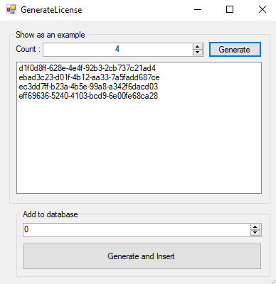
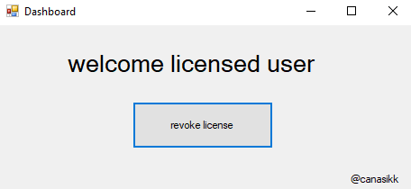

# license-system

I made a simple licensing system on my own scale. I used MySQL and C # to show you how you can generate a license key and compare it with the database. You can further develop it if you want.

v2 https://github.com/canasikk/license-system-v2

Visual Studio MySql Conenctor : https://dev.mysql.com/downloads/connector/net/6.10.html
MySql Xampp : https://www.apachefriends.org/tr/download.html
4.8 : https://dotnet.microsoft.com/download/dotnet-framework/net48

